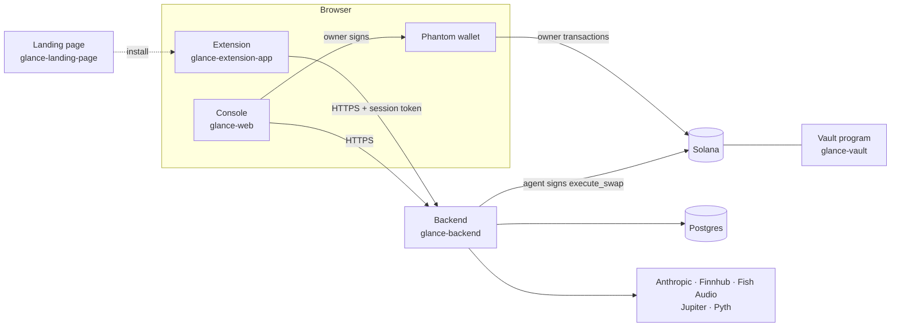
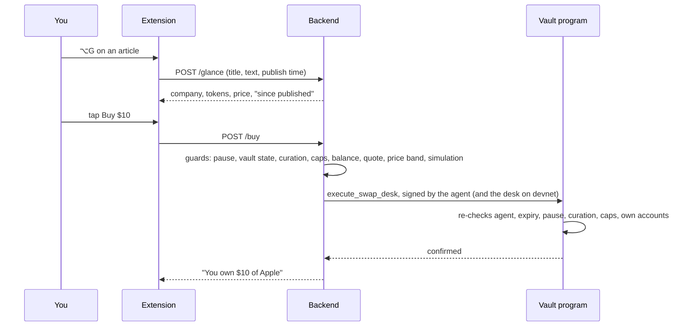

# Glance

**Buy from the headline.**

Glance is a browser extension that recognises the company on any web page, tells you its live price and how it has moved since the story was published, explains the page out loud while drawing on it, and buys or sells that company's tokenized stock on Solana in one tap, with no wallet popup, from a vault only you control.

> **Status: developer preview on Solana devnet.** Test money only; nothing real is bought or sold. Mainnet has open blockers, listed under [Status and roadmap](#status-and-roadmap).

This repository is the entry point. It explains the whole product and links the five code repositories that make it up.

---

## Contents

- [The repositories](#the-repositories)
- [What Glance does](#what-glance-does)
- [How it works](#how-it-works)
- [Each repository in detail](#each-repository-in-detail)
- [Run it locally](#run-it-locally)
- [Configuration](#configuration)
- [Tests](#tests)
- [Deployment](#deployment)
- [AI models and cost](#ai-models-and-cost)
- [Security model](#security-model)
- [Privacy](#privacy)
- [Status and roadmap](#status-and-roadmap)

---

## The repositories

| Repository | What it is | Stack |
|---|---|---|
| [**glance-vault**](https://github.com/heeylana/glance-vault) | The on-chain vault program: per-user vaults, spending caps, curated stock list, the only swap instructions the agent may call. **The security boundary.** | Rust, Anchor, Solana |
| [**glance-backend**](https://github.com/heeylana/glance-backend) | The API: company resolver, prices, news, AI features, trade guards, and the agent that signs swaps | TypeScript, Node 22, Hono, Postgres, Drizzle |
| [**glance-web**](https://github.com/heeylana/glance-web) | The console: where your Phantom wallet signs everything only the owner may do (create account, deposit, withdraw, limits, pause, revoke) | React, Vite, Solana wallet-adapter |
| [**glance-extension-app**](https://github.com/heeylana/glance-extension-app) | The Chrome, Brave and Edge extension: underlines, the orb and buy card, voice, "show me", the side panel | TypeScript, WXT, React, Manifest V3 |
| [**glance-landing-page**](https://github.com/heeylana/glance-landing-page) | The marketing page with the install buttons | Static HTML and CSS, Vercel |

The docs below assume the repositories are cloned side by side:

```
glance/
├── glance-vault/
├── glance-backend/
├── glance-web/
├── glance-extension-app/
└── glance-landing/          ← glance-landing-page, cloned under this name
```

---

## What Glance does

### Reads the page and names the company
- **Passive underlines.** Company names and tickers on any page are underlined from a dictionary shipped to the extension. Nothing leaves the browser for this.
- **Glance (⌥G, or tap the orb).** Glance reads the title, publish time and visible text and resolves the company, even without a ticker ("the Ozempic company" is Novo Nordisk; an "RTX 5090" review is about Nvidia). Site adapters handle X, YouTube and articles.
- **Screenshot fallback.** When a page has no readable text (an image, a canvas, a video frame), Glance reads a screenshot instead and resolves from that.

### Covers every tokenized stock on Solana
A catalog of **932 tokens**:

| Issuer | Tokens | Examples |
|---|---|---|
| xStocks | 885 stocks and 36 ETFs, US and international | Apple, Nvidia, Tesla, Microsoft, BYD, ICBC; S&P 500, Nasdaq, gold |
| PreStocks | 8 pre-IPO companies | OpenAI, Anthropic, SpaceX, Anduril, Neuralink, Figure AI, Kalshi, Polymarket |
| Tessera | 3 pre-IPO tokens | OpenAI, SpaceX, Kalshi |

When a company has several tokens, the buy card shows each one's price and premium over the issuer's own valuation, and preselects the one closest to that valuation.

### Prices it in context
The live on-chain price, today's move, and **how the price has moved since the page was published**, from an hourly price history.

### Buys and sells in one tap
Pick $5, $10, $25 or any amount and tap **Buy**, or say "yes". No wallet popup: the trade runs from your vault, inside limits the program enforces. Sell from the side panel or by voice ("sell all my Nvidia"), always confirmed on a sell card.

### Explains the page and draws on it ("show me")
Hold **⌥V** and ask about what's on screen: "what does this chart show?", "is this a bull flag?", "walk me through these earnings". Glance answers in short spoken lines and draws while it talks:
- circles, underlines and arrows on the page;
- support and resistance lines at the right price, price zones and trend lines on live charts;
- handwritten notes.

If the answer is further down the page or behind a tab, Glance scrolls or clicks there itself, announcing each click so Escape can cancel it. It never clicks anything that buys, pays, signs in or submits.

**Skills** teach it specific jobs: reading candlestick charts and naming classic chart and candle patterns, walking through earnings tables, explaining technical indicators.

### Guides without advising
- "Why did it move?" gives the most-cited cause from the last hour of news, with one caveat.
- A **counter-view** line shows the strongest recent argument against a buy, with whose opinion it is.
- Glance explains and weighs both sides, but **never tells you to buy or sell**.

### Remembers pages you ask it to
Say "remember this" on an article, and Glance keeps a short fact sheet (a summary, key numbers, who said what) **in your browser only**. Ask about it on any other page: "how does this chart compare with the article I saved?".

### Talks
Push-to-talk, with answers read aloud. Examples:
- "buy ten dollars", "make it twenty", "why did it move?"
- "what's my balance?", "what do I own?", "sell all my Apple"
- "remember this page", "scroll down"
- "raise my limit" (Glance says where to do that, since it needs your wallet)

### Keeps the record
The side panel has four tabs:
- **Portfolio**, with Sell.
- **Headlines**: a journal of every story you bought from and how the thesis aged.
- **Waiting**: companies not on-chain yet, with a note when they list.
- **Settings**: limits, pause, remembered pages, voice.

---

## How it works



- **The extension never talks to Solana or to AI services directly.** Its background worker sends every call to the backend with your session token.
- **The backend** resolves companies, prices tokens, runs the AI features, and holds the **agent key**: a hot key whose only on-chain power is the vault's swap instruction.
- **The console** is where your wallet signs owner actions. The backend builds each transaction unsigned; you review and sign it in Phantom.
- **The vault program** holds your money and enforces the rules, whatever the backend asks for.

### The vault: why there's no popup

Setup is once, in about three minutes. Connect Phantom, create your vault with a deposit, and set a **daily limit**. The vault records:

- the **agent** allowed to trade for you, and when that permission **expires** (a week by default, renewable);
- a **per-buy cap** and a **rolling 24-hour cap**, plus the spend in the current window;
- the **maximum price slip**;
- whether it is **paused**.

The agent can only call `execute_swap_*`. On every call the program checks that:

1. the vault isn't paused and the agent's permission hasn't expired;
2. one side is an approved stablecoin and the other a **curated stock**, with its own on-chain approval record (and, where the issuer uses one, the expected Token-2022 permanent delegate, which blocks lookalike tokens);
3. the amount fits the per-buy and daily caps, charged **before** any money moves;
4. money moves only between the vault's own token accounts, and the vault received at least the agreed minimum.

Everything else needs **your** signature: deposit, withdraw, changing limits, pause, unpause, revoking the agent. Withdrawals have no delay.

### A buy, step by step



On devnet, trades fill from an OTC desk at the reference price plus 30 basis points, because Jupiter has no devnet. Each catalog stock trades through a devnet mock mint created on its first buy. On mainnet the same instruction family routes through Jupiter (`execute_swap_router`).

### Knowing which company it is

- **The dictionary** covers about 930 companies: 58 hand-tuned public companies, 8 hand-written private ones, and about 870 generated from the catalog.
  - Each entry includes names, tickers, token symbols, products and people.
  - Common words and news acronyms are marked ambiguous and need more evidence before they count.
- **Scoring runs in two places on purpose:** in the extension for instant underlines, and on the backend for the full glance.
- **A language model is asked only when the dictionary is unsure.** Its answer is cached per page for 30 minutes.
- **It's measured:** a scorer runs the resolver against 51 captured real pages. It currently resolves all 45 company pages (41 without asking the user to confirm) and declines all 6 pages that are about no company.

---

## Each repository in detail

### [glance-vault](https://github.com/heeylana/glance-vault): the Anchor program

- **Program ID (devnet):** `DP7QYPQZh2XqMREGWQ5MNo1vgGUSZbfAzJu3uRQATnmy`.
- **Accounts:**
  - `Config` `["config"]`: admin with two-step rotation, desk, router, stable mints, agent lifetime.
  - `AllowedMint` `["allowed", mint]`: one per curated stock, with its issuer rule.
  - `Vault` `["vault", owner]`: agent, expiry, caps, rolling window, pause.
- **Instructions:**
  - Admin: `init_config` (the upgrade authority only, so nobody can front-run the configuration), `update_config`, `propose_admin` / `accept_admin`, `allow_mint` / `disallow_mint`.
  - Owner: `initialize_vault`, `deposit`, `withdraw`, `set_policy`, `pause` / `unpause`, `revoke_agent`.
  - Agent: `execute_swap_desk`, `execute_swap_router`.
- **`security-checklist.md`** lists every applied rule, the deliberate risks and the known limitations. Read it before changing anything.
- **Commands:**
  ```bash
  anchor build
  NODE_OPTIONS=--dns-result-order=ipv4first anchor test --skip-build   # 27 tests on a local validator
  anchor deploy --provider.cluster devnet
  ```

### [glance-backend](https://github.com/heeylana/glance-backend): the API and the agent

**Routes:**
- `/glance` and `/glance/vision`: resolve a page, or a screenshot of one.
- `/buy`, `/sell`: delegated trades.
- `/why`, `/counter-view`: news answers.
- `/explain` ("show me"), `/remember`, `/voice`, `/tts`.
- `/session`, `/portfolio`, `/journal`, `/watchlist`, `/dictionary`.
- `/auth/*`: sign-in by wallet signature and the extension handoff.
- `/vault/tx`: unsigned owner transactions for the console.

**Where things live:**
- `src/services/trade.ts`: the trade pipeline.
- `src/resolver/`: the resolver.
- `src/services/llm.ts`: every AI call, with usage and cost logging.
- `src/lib/structured.ts`: keeps a model's answer when it runs past a length limit, instead of discarding it.
- `src/config/catalog.json`: the token catalog, refreshed from the issuers' APIs.
- **`skills/`:** one Markdown file per skill; see `skills/README.md`.
  - Sections can carry their own trigger words, so large references (the pattern catalogue) are sent only when a question needs them.
  - Skills reload without a restart.

**Scripts:**

| Script | What it does |
|---|---|
| `pnpm tsx src/scripts/setup-devnet.ts` | Keys, mock USDC, mock stock mints, on-chain config (idempotent) |
| `pnpm tsx src/scripts/allow-mints.ts` | Curate every registry mint on-chain |
| `pnpm script:delegated-swap buy AAPL 10` | A delegated buy from the command line |
| `pnpm script:refresh-catalog` | Rebuild the token catalog from xStocks, PreStocks and Tessera |
| `pnpm script:score-resolver [--llm]` | Resolver accuracy on 51 real pages |
| `pnpm script:score-voice` | Voice-command accuracy of the model fallback |
| `pnpm script:compare-news --models a,b --out r.md` | "Why" and counter-view side by side on frozen headlines |
| `pnpm script:replay-explain --tokens` / `--configs … --out r.html` | Replay captured "show me" questions on other models, with the marks drawn on each screenshot |
| `pnpm script:cache-probe` | Confirm prompt caching works for "show me" |

### [glance-web](https://github.com/heeylana/glance-web): the console

**Two paths:**
- `/connect`: the extension's sign-in handoff.
- Everything else: the account page, covering sign-in by message signature, create account, deposit, withdraw (cash or the stock itself), daily limit and renewal, pause and revoke.

**How it works:**
- The backend builds each transaction; Phantom signs it.
- `VITE_BACKEND_URL` is compiled in. One browser can point at another backend with `localStorage` `glance:backend`.

### [glance-extension-app](https://github.com/heeylana/glance-extension-app): the extension

**Entry points:**
- `entrypoints/content`: underlines, the orb and card, "show me" drawing, voice actions, scroll and click.
- `entrypoints/background`: every backend call.
- `entrypoints/sidepanel`: Portfolio, Headlines, Waiting, Settings.
- `entrypoints/recorder` and `entrypoints/mic`: push-to-talk, with the microphone owned by the extension and never the page.

**Design:** glass cards, one accent colour, Space Grotesk and IBM Plex Mono.

**Commands:**
- `pnpm build`: load `dist/chrome-mv3` unpacked.
- `pnpm dev`: hot reload.
- `pnpm zip`: store upload.
- `pnpm preview <owner>`: screenshots of every screen.

### [glance-landing-page](https://github.com/heeylana/glance-landing-page): the landing page

- Static `index.html` and `styles.css`, with `vercel.json` for headers and caching. No build step.
- Hero and demo videos are slots with fallbacks until recorded.
- Install buttons point at the extension's store listing.
- Preview with `python3 -m http.server 8080`.

---

## Run it locally

### Prerequisites

- **Node 22 and pnpm 11**, for the backend, console and extension.
- **Postgres** on port 5432 with a `glance` database.
- **Phantom**, set to **devnet**, in Chrome or Brave.
- **For the program:**
  - Rust 1.89.0 (pinned in `rust-toolchain.toml`), the Solana CLI, Anchor, yarn.
  - A devnet wallet at `~/.config/solana/id.json` with a few SOL (`solana airdrop 2 --url devnet`).
- **Optional keys:** Anthropic (AI features), Finnhub (news), Fish Audio (voice).

### Clone

```bash
mkdir glance && cd glance
git clone https://github.com/heeylana/glance-vault.git
git clone https://github.com/heeylana/glance-backend.git
git clone https://github.com/heeylana/glance-web.git
git clone https://github.com/heeylana/glance-extension-app.git
git clone https://github.com/heeylana/glance-landing-page.git glance-landing
```

### Your own devnet program

The shared devnet program's configuration can only be changed by its admin key, which the maintainer holds. To run the setup script yourself, deploy your own copy:

```bash
cd glance-vault
yarn install
solana-keygen new -o target/deploy/glance_vault-keypair.json   # a new program ID
anchor keys sync                                               # writes it into lib.rs and Anchor.toml
anchor build && anchor deploy --provider.cluster devnet       # ~2.5 devnet SOL
cp target/idl/glance_vault.json target/types/glance_vault.ts ../glance-backend/src/idl/
```

Then set `VAULT_PROGRAM_ID` in the backend's `.env` to the new ID.

### Backend

```bash
cd glance-backend
cp .env.example .env              # set SESSION_SECRET to a long random string; add your API keys
pnpm install
pnpm db:push                      # create the tables
pnpm tsx src/scripts/setup-devnet.ts   # keys, mock USDC, mock stocks, on-chain config; prints .env lines to copy
pnpm dev                          # http://localhost:8787
curl -s localhost:8787/health     # shows agent, vaultProgram, route: desk
```

### Console

```bash
cd glance-web
cp .env.example .env              # VITE_BACKEND_URL=http://localhost:8787
pnpm install && pnpm dev          # http://localhost:5173
```

### Extension

```bash
cd glance-extension-app
cp .env.example .env              # WXT_BACKEND_URL, WXT_CONSOLE_URL, WXT_USDC_MINT (= the backend's USDC_MINT)
pnpm install && pnpm build        # then chrome://extensions → Developer mode → Load unpacked → dist/chrome-mv3
```

Without the maintainer's `.keys/extension-pubkey.txt`, Chrome gives your build its own extension ID. That's fine locally.

### Use it

1. Click the Glance icon → **Connect wallet** → sign the message in the console tab.
2. **Get $50 test USDC** → **Create account** (one Phantom signature).
3. Open an article about Apple, Nvidia or Tesla, press **⌥G**, pick $10, **Buy**. No popup.
4. Hold **⌥V** on a chart and ask "what does this chart show?".

After changing the backend's `.env`, restart it. After rebuilding the extension, reload it in `chrome://extensions` and reload open tabs.

---

## Configuration

Every repository has a `.env.example`. The settings that matter most:

| Repository | Setting | Notes |
|---|---|---|
| backend | `SOLANA_CLUSTER`, `SOLANA_RPC_URL`, `VAULT_PROGRAM_ID` | Devnet today |
| backend | `USDC_MINT` | Must be one of the registry's stable mints, or every buy fails (the startup log says so) |
| backend | `SESSION_SECRET`, `WEB_CONSOLE_URL`, `ALLOWED_ORIGINS` | `ALLOWED_ORIGINS` (the extension's and console's origins) is required in production |
| backend | `ANTHROPIC_API_KEY`, `LLM_MODEL`, `LLM_FAST_MODEL`, `LLM_READ_MODEL`, `LLM_VISION_EFFORT`, `LLM_VISION_THINKING` | See [AI models and cost](#ai-models-and-cost) |
| backend | `NEWS_API_KEY`, `FISH_AUDIO_API_KEY`, `JUPITER_API_KEY`, `PYTH_API_KEY` | Each feature degrades on its own when empty |
| backend | `EVAL_CAPTURE_DIR`, `DEV_LOGIN` | **Development only.** Never set in production |
| console | `VITE_BACKEND_URL`, `VITE_SOLANA_RPC_URL` | Compiled in and public |
| extension | `WXT_BACKEND_URL`, `WXT_CONSOLE_URL`, `WXT_SOLANA_CLUSTER`, `WXT_SOLANA_RPC_URL`, `WXT_USDC_MINT` | Compiled in and public |

Values in `VITE_*` and `WXT_*` end up in files anyone can read. Never put a secret there, including a paid RPC URL with an API key in it.

---

## Tests

| Repository | Command | What it covers |
|---|---|---|
| glance-vault | `anchor test --skip-build` | 27 tests on a local validator: the desk path, curation, caps, expiry, pause, every rejection |
| glance-backend | `pnpm test && pnpm typecheck` | 212 tests: guards, resolver, voice grammar, skills, structured-answer repair, costs, caches, "show me" sanitising |
| glance-extension-app | `pnpm test && pnpm compile` | 55 tests: matcher, adapters, click refusals, drawing geometry, remembered-page selection, CSS guards |
| glance-web | `pnpm compile` | Type checks (no unit tests) |

**AI evaluations** (they cost a little to run):
- `score-resolver --llm`: company matching on 51 real pages.
- `score-voice`: 24 spoken phrasings.
- `compare-news`: "why" and counter-view side by side.
- `replay-explain`: "show me" on captured real questions, compared across models and settings.

---

## Deployment

Today's deployable target is a **hosted devnet preview**. Deploy in this order:

1. **Program:** already on devnet, or your own copy.
2. **Postgres.**
3. **Backend:**
   - one Node 22 instance, started with `pnpm start`;
   - a persistent disk for `.keys/` and the devnet mock registry;
   - HTTPS, with 10 MB request bodies and timeouts of 60 s or more.
4. **Console:** static hosting, with a rewrite that serves `index.html` for every path.
5. **Extension:** Chrome Web Store; pin the store's ID.
6. **Landing page.**
7. **Lock down:** set `ALLOWED_ORIGINS`, and make sure `DEV_LOGIN` and `EVAL_CAPTURE_DIR` are off.

Three things that break a deployment silently:

- **A missing agent key.** If `.keys/agent.json` isn't there, the backend makes a new agent key, and every existing user has to renew in the console.
- **The compiled build.** `tsc` doesn't copy the JSON registry files the server reads at runtime, so run it through `tsx` (`pnpm start`), with dev dependencies installed.
- **Baked-in addresses.** The backend and console URLs are compiled into the console and the extension, so a new URL means a new build.

---

## AI models and cost

Glance uses Claude through the Anthropic API directly, with a model chosen per job:

| Job | Model | Setting | Measured cost per call |
|---|---|---|---|
| "Show me" (sees the screenshot, draws on it) | Claude Sonnet 5, effort `low` | `LLM_MODEL` / `LLM_VISION_MODEL` | ~2.0¢ with a warm prompt cache |
| Company matching, "why", counter-view, voice fallback, remember | Claude Haiku 4.5 | `LLM_FAST_MODEL` | ~0.1–0.2¢ |
| Screenshot fallback (transcription only) | Claude Haiku 4.5 | `LLM_READ_MODEL` | ~0.4¢ |

How cost is kept down:

- **Every call logs an `llm usage` line** with its tokens, its dollar cost and the day's running total per job.
- **Repeated answers come from caches in the app:** "why" for 10 minutes per ticker, company matching for 30 minutes per page.
- **"Show me" caches its instructions and skills** with prompt caching.
- **The element map is compacted** before it's sent. It's about two thirds of a "show me" request.
- **Skills and skill sections are sent only when a question calls for them.**
- **A model that runs past a length limit has its answer trimmed**, not discarded after it's been billed.

Compared with running everything on Claude Opus 5, "show me" costs about 2.9× less and the short jobs 5–7× less, measured on real pages. A replay tool compares models and settings on captured real questions before any change becomes the default.

---

## Security model

**A compromised Glance backend** holds the agent key (and the desk key on devnet). Inside a vault that granted the agent and hasn't paused or expired, it can:

- buy curated stocks with the vault's stable balance, up to the per-buy and rolling daily caps;
- sell curated stocks back to stable.

That is the whole of it. It **cannot**:

- withdraw, or move value to any other account;
- touch a mint that isn't curated (lookalike and junk tokens are rejected on-chain, not just filtered off-chain);
- extend its own expiry or raise its own caps.

**What it can still get wrong is the price.** There is no on-chain oracle bound yet: the minimum output comes from the agent. A dishonest backend and desk together could fill you at a bad price, bounded by your daily cap. The backend's own price band against Pyth or Jupiter normally prevents it, and an on-chain bound is required before mainnet.

**A leaked agent key alone** is weaker still. The devnet desk path also needs the desk's co-signature, and the key is bounded by the same policy. One Phantom approval revokes it.

**A backend outage** executes nothing. Your funds stay in your vault, and you can withdraw, pause or revoke from the console with Phantom at any time.

**The program's upgrade authority** is a single developer key on devnet. It moves to a multisig before mainnet; `init_config` is already restricted to it.

The full list of applied rules, deliberate risks and known limitations is in [`glance-vault/security-checklist.md`](https://github.com/heeylana/glance-vault/blob/main/security-checklist.md).

---

## Privacy

- **While you browse, nothing is sent.** Underlines come from a dictionary in the extension.
- **Page text leaves the browser only when you ask.** That means pressing ⌥G, tapping the orb, asking a question or saying "remember this".
- **"Show me" sends the visible part of the page once**, a screenshot and the text on screen, so it can answer and draw. It isn't stored. The backend logs only the site's host and counts. A developer-only capture setting (`EVAL_CAPTURE_DIR`), off by default, is the only exception, for building evaluations on a developer's own machine.
- **The screenshot fallback's image is discarded after it's read.** Only its hash is kept, on the journal entry of a buy made from it.
- **Remembered pages stay in your browser**, in the extension's local storage. They're kept 30 days and can be deleted in Settings. The backend builds the fact sheet when you ask and keeps nothing.
- **The journal** (headlines you bought from, your notes) is stored per wallet and can be deleted in Settings.
- **The microphone is on only while you hold ⌥V or the orb.** The recording goes to Fish Audio once to be transcribed and isn't stored. Websites never get the microphone or its permission prompt.
- **Spoken replies are voiced by Fish Audio.** The sentence contains the company and price, nothing about you or the page.
- **Clicking has hard limits.** Glance only scrolls and clicks when you ask. It never clicks anything that buys, sells, pays, submits, signs in, posts or deletes, and it never types. It can be turned off in Settings.

---

## Status and roadmap

**Working on devnet today:**
- the vault program, with per-mint curation (v2);
- delegated buys and sells with no popups, from a real browser;
- the full resolver, with its 51-page test set;
- the 932-token catalog, including pre-IPO tokens;
- "show me" with chart drawing and skills;
- voice, remembered pages, the journal, the watchlist and the console.

**Before mainnet** (details in the vault's security checklist):
- Exercise the Jupiter router path on a mainnet fork. It compiles and rejects correctly, but its successful path hasn't run.
- Support Token-2022 transfer fees and transfer hooks, which the real PreStocks and Tessera mints use. xStocks are unaffected.
- Add an on-chain oracle price bound.
- Put the admin key and upgrade authority on a multisig, and the agent key in a KMS or TEE.
- Write a mainnet bootstrap script: Jupiter router, mainnet USDC, curation from the mainnet registry.
- Settle KYC and availability with each issuer, and get an audit.

**Next:**
- Solflare and Backpack support.
- An Android overlay.
- More "show me" skills: options chains, filings.
- Recurring buys.
- A fiat on-ramp.
- Safari and Firefox.

---

*Tokenized equities carry risk, including total loss. Glance is software, not a broker or an adviser, and does not hold your funds. This is a developer preview on a test network; no real money moves.*
